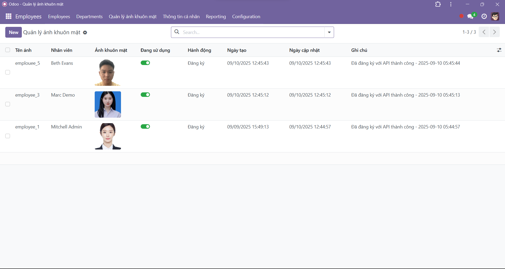
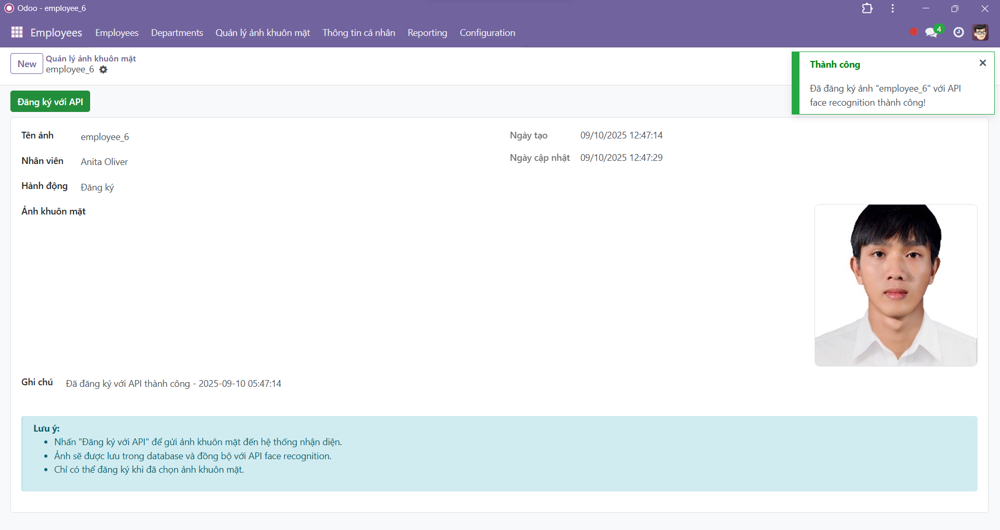
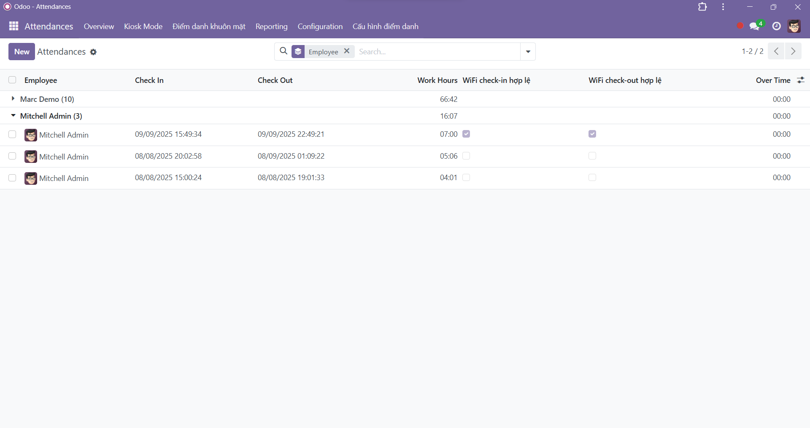
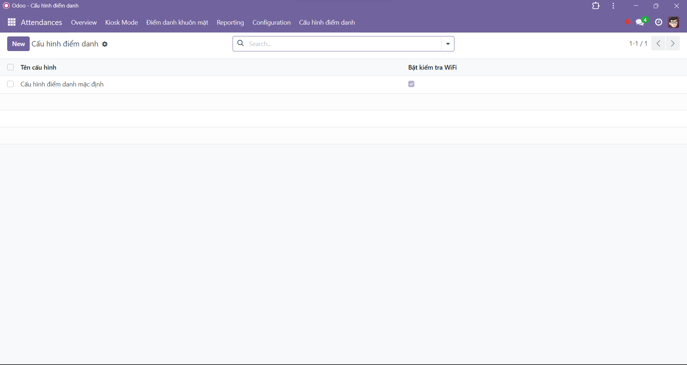
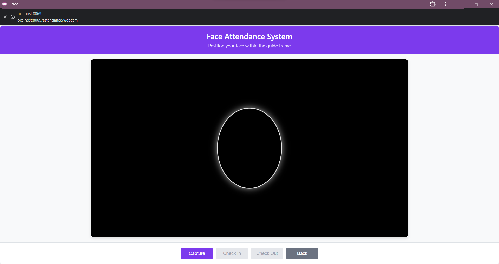
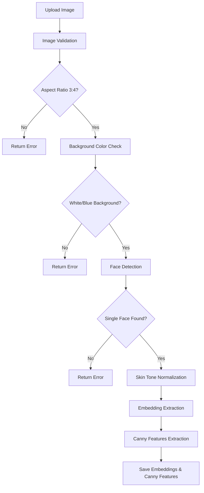
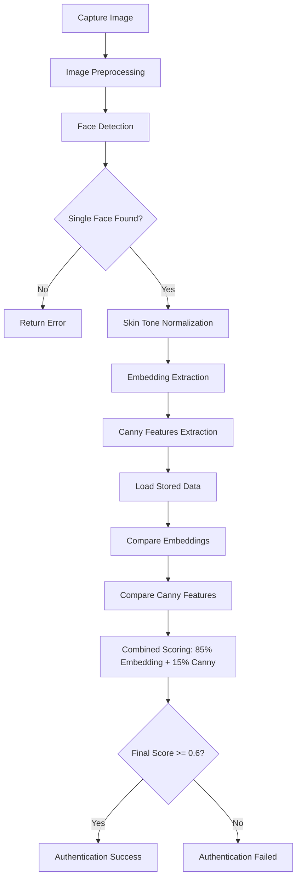

# Face Attendance System
<h1> Tài khoản đăng nhập: admin </h1>
<h1> Mật khẩu: admin </h1>
<div align="center">
  
  
</div>

<div align="center">
  
  
</div>

<div align="center">
  
  
</div>

<div align="center">
  
  
</div>

<div align="center">
  
  
</div>

---

Hệ thống điểm danh bằng khuôn mặt tích hợp với Odoo, sử dụng AI và Computer Vision để xác thực khuôn mặt với độ chính xác cao.

## Links

- 🌐 **Demo Website**: [https://attendance-system.ddns.net](https://attendance-system.ddns.net)


## Công nghệ sử dụng

### Backend Technologies
- **Odoo 16+** - ERP framework chính cho quản lý nhân sự và điểm danh
- **Python 3.8+** - Ngôn ngữ lập trình chính
- **PostgreSQL 13** - Cơ sở dữ liệu chính
- **FastAPI 0.104.1** - Web framework cho Face Recognition API
- **Uvicorn** - ASGI server cho FastAPI

### Face Recognition & AI
- **InsightFace 0.7.3** - Thư viện AI nhận diện khuôn mặt tiên tiến
- **OpenCV 4.8.1** - Computer Vision cho xử lý ảnh và video
- **ONNX Runtime 1.18.1** - Runtime cho các mô hình AI
- **NumPy 1.24.3** - Xử lý mảng và tính toán khoa học
- **Scikit-image 0.21.0** - Xử lý ảnh nâng cao

### Frontend Technologies
- **Odoo Web Framework** - Giao diện web tích hợp sẵn trong Odoo
- **HTML5/CSS3/JavaScript** - Frontend templates và static files
- **WebRTC** - Truy cập camera trực tiếp từ trình duyệt
- **Odoo QWeb Templates** - Template engine của Odoo

### Mobile Technologies (Flutter App)
- **Flutter 3.1.0+** - Cross-platform mobile framework
- **Dart** - Ngôn ngữ lập trình cho Flutter
- **Camera Plugin 0.10.5** - Truy cập camera trên mobile
- **HTTP 1.1.0** - HTTP client cho API calls
- **Provider 6.1.1** - State management
- **Shared Preferences 2.2.2** - Local storage
- **Flutter Secure Storage 9.0.0** - Secure data storage
- **Permission Handler 11.0.1** - Quản lý quyền truy cập

### DevOps & Infrastructure
- **Docker & Docker Compose** - Containerization và orchestration
- **Git** - Version control system


### Advanced Features
- **Multiple Face Registration** - Đăng ký nhiều góc chụp
- **Skin Tone Normalization** - Chuẩn hóa màu da
- **Background Validation** - Kiểm tra nền ảnh
- **Face Quality Enhancement** - Tăng chất lượng ảnh khuôn mặt
- **Embedding Diversity Analysis** - Phân tích độ đa dạng đặc trưng
- **Real-time Processing** - Xử lý thời gian thực

## Kiến trúc hệ thống

```
                        ┌──────────────────┐
                        │   Mobile App     │
                        │   (Flutter)      │
                        │   REST API       │
                        └──────────────────┘
                                  |
                                  v
┌─────────────────┐    ┌──────────────────┐    ┌─────────────────┐
│   Web Frontend  │    │   Odoo ERP       │    │  Face Recognition│
│   (WebRTC UI)   │───▶│   Controller     │───▶│   API Service   │
│                 │    │   (Python)       │    │   (FastAPI+AI)  │
└─────────────────┘    └──────────────────┘    └─────────────────┘
         │                       │                       │
         │              ┌──────────────────┐             │
         │              │   PostgreSQL     │             │
         └──────────────│   Database       │─────────────┘
                        │   (Odoo Data)    │
                        └──────────────────┘
                                 
                        
```

## Luồng hoạt động

1. **Nhân viên sử dụng Face Attendance**: Truy cập vào menu "Face Attendance" trong Odoo
2. **Chụp ảnh khuôn mặt**: Nhân viên chụp ảnh khuôn mặt qua webcam
3. **Gửi ảnh về Controller**: Frontend gửi ảnh về Odoo controller
4. **Gọi API Face Recognition**: Controller gọi API service để xác thực khuôn mặt
5. **Xử lý bằng AI**: API service sử dụng InsightFace và OpenCV để:
   - Phát hiện và chuẩn hóa khuôn mặt trong ảnh
   - Trích xuất embedding vector từ khuôn mặt
   - So sánh với các embedding đã lưu (hỗ trợ nhiều ảnh)
   - Áp dụng các bộ lọc chất lượng và validation
   - Trả về kết quả xác thực với confidence score
6. **Lưu attendance**: Nếu xác thực thành công, lưu bản ghi attendance vào Odoo

## Cài đặt và chạy

### Yêu cầu hệ thống
- Docker và Docker Compose
- Python 3.8+ (cho development)
- Webcam hỗ trợ

### Chạy bằng Docker Compose


 **Chạy hệ thống**:
```bash
docker-compose up -d
```

 **Truy cập ứng dụng**:
- Odoo: http://localhost:8069
- Face Recognition API: http://localhost:8000


### API Configuration
- URL: http://localhost:8000 (có thể thay đổi trong controller)
- Port: 8000
- CORS: Đã cấu hình để cho phép Odoo gọi API

## Sử dụng

### 1. Đăng ký khuôn mặt (lần đầu)
- Đăng nhập vào Odoo với tài khoản nhân viên
- Truy cập menu "Face Attendance"
- Chụp ảnh khuôn mặt và nhấn "Register Face"

### 2. Check-in/Check-out hàng ngày
- Truy cập menu "Face Attendance"
- Chụp ảnh khuôn mặt
- Nhấn "Check In" hoặc "Check Out"

## API Endpoints

### Face Recognition API (Port 8000)

#### POST /face-recognition/verify
Xác thực khuôn mặt cho check-in/check-out
```json
{
  "face_image": "base64_image_data",
  "action": "check_in|check_out",
  "employee_id": 123
}
```

#### POST /face-recognition/register
Đăng ký khuôn mặt cho nhân viên mới
```json
{
  "face_image": "base64_image_data"
}
```

#### GET /face-recognition/health
Kiểm tra trạng thái API

### Odoo Controller Endpoints

#### POST /attendance/check_in
Check-in với xác thực khuôn mặt

#### POST /attendance/check_out
Check-out với xác thực khuôn mặt

#### POST /attendance/register_face
Đăng ký khuôn mặt

#### GET /attendance/face_api_health
Kiểm tra trạng thái API face recognition

## Tính năng

### Face Recognition
- Phát hiện khuôn mặt sử dụng InsightFace AI models
- Trích xuất embedding vectors với độ chính xác cao
- Hỗ trợ đăng ký nhiều ảnh từ các góc khác nhau
- Chuẩn hóa màu da và tăng chất lượng ảnh
- Kiểm tra nền ảnh và tỷ lệ khung hình (3:4)
- So sánh khuôn mặt với cosine similarity
- Lưu trữ multiple embeddings cho mỗi nhân viên

### Security
- Xác thực người dùng Odoo
- Kiểm tra session
- Validation dữ liệu đầu vào
- Error handling toàn diện

### User Experience
- Giao diện webcam responsive
- Real-time camera preview
- Hướng dẫn định vị khuôn mặt
- Thông báo kết quả rõ ràng

## Troubleshooting

### API không kết nối được
1. Kiểm tra service face_recognition_api đã chạy chưa
2. Kiểm tra port 8000 có bị block không
3. Kiểm tra URL trong controller có đúng không

### Camera không hoạt động
1. Kiểm tra quyền truy cập camera
2. Kiểm tra webcam có được hỗ trợ không
3. Thử refresh trang

### Face recognition không chính xác
1. Đảm bảo ánh sáng đủ sáng
2. Khuôn mặt phải rõ ràng, không bị che
3. Chỉ có một khuôn mặt trong khung hình

## Custom API Services Module - Khái niệm và Luồng hoạt động chi tiết

### Kiến trúc Module Custom API Services

Module `custom_api_services` là trái tim của hệ thống Face Recognition, được thiết kế theo kiến trúc phân lớp rõ ràng:

```
custom_api_services/
├── main.py                    # Entry point - FastAPI application
├── app/
│   ├── config.py             # Cấu hình toàn cục và thông số AI
│   ├── api/
│   │   └── routes.py         # REST API endpoints definition
│   ├── services/
│   │   └── face_recognition_service.py  # Business logic layer
│   ├── core/                 # Core AI processing modules
│   │   ├── face_embeddings.py      # InsightFace embedding extraction
│   │   ├── face_detection.py       # Face detection algorithms
│   │   ├── face_alignment.py       # Face alignment and normalization
│   │   ├── skin_normalization.py   # Skin tone normalization
│   │   ├── canny_features.py       # Canny edge feature extraction
│   │   ├── image_processing.py     # Image preprocessing utilities
│   │   ├── validation.py           # Image validation rules
│   │   └── file_operations.py      # File I/O operations
│   └── models/
│       └── face_models.py          # InsightFace model management
├── employee_faces/           # Lưu trữ ảnh khuôn mặt nhân viên
└── employee_canny_features/  # Lưu trữ Canny features
```

### Các khái niệm cốt lõi cần hiểu

#### 1. Face Embeddings (Vector đặc trưng) - **PHƯƠNG PHÁP CHÍNH**
- **Mục đích**: Phương pháp chính để nhận diện khuôn mặt trong hệ thống
- **Trọng số**: 85% trong quyết định cuối cùng (kết hợp với Canny 15%)
- **Ngưỡng**: 0.6 (COSINE_THRESHOLD trong config)
- **Định nghĩa**: Vector 512 chiều từ mô hình InsightFace ArcFace
- **Ưu điểm**: Độ chính xác cao, bất biến với góc chụp và ánh sáng

#### 2. Canny Features (Đặc trưng biên Canny) - **PHƯƠNG PHÁP BỔ TRỢ**
- **Mục đích**: Bổ trợ cho embeddings, tăng độ tin cậy
- **Trọng số**: 15% trong quyết định cuối cùng (kết hợp với Embeddings 85%)
- **Quy trình**: Canny edge detection → contour extraction → feature points comparison
- **Ưu điểm**: Ít bị ảnh hưởng bởi thay đổi ánh sáng, xử lý nhanh

#### 3. Skin Tone Normalization (Chuẩn hóa màu da)
- **Mục đích**: Giảm thiểu ảnh hưởng của điều kiện ánh sáng khác nhau
- **Phương pháp**: Phân tích HSV, tìm điểm da sáng nhất, điều chỉnh toàn bộ vùng mặt
- **Áp dụng**: Cả registration và verification trước khi trích xuất embeddings và Canny features
- **Kết quả**: Tăng độ chính xác nhận diện trong điều kiện ánh sáng khác nhau

#### 4. Image Validation (Kiểm tra tính hợp lệ ảnh)
- **Aspect Ratio**: Chấp nhận tỷ lệ 3:4 (0.75) hoặc 4:6 (0.667) với tolerance ±5%
- **Background Color**: Kiểm tra nền trắng hoặc xanh bằng Euclidean distance
- **Áp dụng**: Strict validation cho registration, lenient cho verification

#### 5. Face Detection (Phát hiện khuôn mặt)
- **Phương pháp chính**: InsightFace với confidence threshold ≥ 0.6
- **Fallback**: OpenCV Haar Cascade nếu InsightFace thất bại
- **Xử lý**: Chỉ chấp nhận 1 khuôn mặt, chọn khuôn mặt lớn nhất nếu có nhiều

### Luồng xử lý chi tiết

#### A. Luồng đăng ký khuôn mặt (Registration Flow)



**Chi tiết từng bước:**

1. **Image Validation** (`validation.py`):
   
   **Bước đầu tiên**: Hệ thống nhận ảnh từ client và bắt đầu quá trình kiểm tra tính hợp lệ.
   
   - **Kiểm tra tỷ lệ khung hình**: Đo chiều rộng và chiều cao của ảnh, tính tỷ lệ `width/height`. Hệ thống chấp nhận tỷ lệ 3:4 (0.75) hoặc 4:6 (0.667) với độ sai lệch ±5%. Nếu tỷ lệ không đúng, trả về thông báo lỗi ngay lập tức.
   
   - **Phân tích màu nền**: Lấy mẫu pixel từ 4 cạnh viền của ảnh (trên, dưới, trái, phải), tính màu trung bình của vùng viền. So sánh với màu chuẩn (trắng RGB(255,255,255) hoặc các tông xanh) bằng khoảng cách Euclidean. Nếu khoảng cách > ngưỡng cho phép, từ chối ảnh.
   
   - **Kết quả**: Nếu cả hai điều kiện đều thỏa mãn, ảnh được chuyển sang bước tiếp theo. Ngược lại, trả về thông báo lỗi cụ thể để người dùng biết cách khắc phục.

2. **Face Detection** (`face_detection.py`):
   
   **Tiếp theo**: Sau khi ảnh đã được validate, hệ thống bắt đầu tìm kiếm khuôn mặt trong ảnh.
   
   - **Phương pháp chính - InsightFace**: Sử dụng mô hình AI InsightFace để phát hiện khuôn mặt. Mô hình này trả về tọa độ bounding box (x, y, width, height) và confidence score cho mỗi khuôn mặt được phát hiện. Chỉ chấp nhận những khuôn mặt có confidence ≥ 0.6.
   
   - **Phương pháp dự phòng - OpenCV**: Nếu InsightFace không phát hiện được khuôn mặt nào, hệ thống chuyển sang sử dụng Haar Cascade classifier của OpenCV với các tham số: scaleFactor=1.1, minNeighbors=4, minSize=(60,60).
   
   - **Lựa chọn khuôn mặt**: Nếu phát hiện được nhiều khuôn mặt, hệ thống chọn khuôn mặt có diện tích lớn nhất (width × height). Nếu không tìm thấy khuôn mặt nào, trả về lỗi "Không thể phát hiện khuôn mặt".

3. **Skin Tone Normalization** (`skin_normalization.py`):
   
   **Bước chuẩn hóa**: Sau khi đã xác định được vị trí khuôn mặt, hệ thống tiến hành chuẩn hóa màu da để giảm ảnh hưởng của ánh sáng.
   
   - **Tạo vùng quan tâm**: Mở rộng bounding box của khuôn mặt thêm 10% về mỗi phía để có đủ context. Crop vùng này từ ảnh gốc.
   
   - **Phân tích màu da**: Chuyển đổi vùng khuôn mặt sang không gian màu HSV. Tạo mask để phát hiện vùng da dựa trên khoảng giá trị HSV đặc trưng của da người: H(0-25, 160-180), S(20-255), V(20-255).
   
   - **Tìm điểm reference**: Trong vùng da đã được mask, tìm pixel có độ sáng cao nhất trong không gian Lab (L-channel). Đây sẽ là điểm chuẩn để điều chỉnh màu.
   
   - **Áp dụng normalization**: Tính vector điều chỉnh màu từ điểm sáng nhất. Áp dụng điều chỉnh này lên toàn bộ vùng khuôn mặt với độ mạnh 60% và sử dụng Gaussian blur để tạo hiệu ứng mềm mại.

4. **Face Quality Enhancement** (`image_processing.py`):
   
   **Bước tăng chất lượng**: Với khuôn mặt đã được chuẩn hóa màu da, hệ thống tiếp tục cải thiện chất lượng ảnh.
   
   - **Mở rộng vùng khuôn mặt**: Tăng kích thước bounding box thêm 20% về mỗi phía để có thêm context xung quanh khuôn mặt. Điều này giúp mô hình AI hoạt động tốt hơn.
   
   - **Giảm nhiễu**: Áp dụng Gaussian blur nhẹ (kernel 3x3, sigma=0.5) để làm mịn ảnh và giảm nhiễu pixel.
   
   - **Cải thiện độ tương phản**: Sử dụng CLAHE (Contrast Limited Adaptive Histogram Equalization) với clipLimit=2.0 và tileGridSize=(8,8) để cân bằng độ tương phản cục bộ, làm nổi bật các đặc điểm khuôn mặt.
   
   - **Tăng độ sắc nét**: Áp dụng unsharp masking filter để tăng độ sắc nét của các cạnh và đường nét khuôn mặt mà không tạo ra artifacts.

5. **Canny Features Extraction** (`canny_features.py`):
   
   **Bước trích xuất đặc trưng chính**: Đây là bước quan trọng nhất, trích xuất Canny features để nhận diện khuôn mặt.
   
   - **Crop face region**: Cắt vùng khuôn mặt với margin 10% để có đủ context xung quanh.
   
   - **Chuyển đổi grayscale**: Convert ảnh khuôn mặt sang ảnh xám để chuẩn bị cho Canny edge detection.
   
   - **Resize chuẩn**: Resize về kích thước 200x200 pixels để đảm bảo tính nhất quán.
   
   - **Gaussian blur**: Áp dụng Gaussian blur (5x5 kernel) để giảm nhiễu trước khi detect edges.
   
   - **Canny edge detection**: Áp dụng thuật toán Canny với threshold thấp=50, threshold cao=150 để phát hiện các cạnh trong khuôn mặt.
   
   - **Contour extraction**: Tìm contours từ edges và trích xuất feature points từ các contours này.
   
   - **Lưu trữ features**: Lưu Canny features vào file `employee_{id}_canny.npy`.

6. **Save Face Image**:
   
   **Bước lưu trữ**: Lưu ảnh khuôn mặt đã được crop và xử lý.
   
   - **Extract face region**: Cắt chính xác vùng khuôn mặt với margin 5% từ ảnh gốc.
   
   - **Lưu file**: Lưu ảnh khuôn mặt vào `employee_faces/employee_{id}.jpg` để sử dụng cho các mục đích khác.

#### B. Luồng xác thực khuôn mặt (Verification Flow)



**Chi tiết quy trình verification:**

1. **Image Preprocessing**:
   
   **Bước khởi đầu**: Khi nhân viên chụp ảnh để check-in/check-out, ảnh được gửi đến API và trải qua preprocessing pipeline.
   
   - **Process uploaded image**: Đọc và decode ảnh từ multipart form data.
   
   - **Preprocess image**: Resize và chuẩn hóa ảnh để chuẩn bị cho face detection.

2. **Face Detection và Validation**:
   
   **Phát hiện khuôn mặt**: Sử dụng InsightFace để detect faces trong ảnh đã được preprocess.
   
   - **Kiểm tra số lượng faces**: Phải có đúng 1 khuôn mặt, nếu không có hoặc có nhiều hơn 1 thì trả về lỗi.
   
   - **Lấy face info**: Trích xuất thông tin bounding box và face object từ kết quả detection.

3. **Skin Tone Normalization**:
   
   **Chuẩn hóa màu da**: Áp dụng skin tone normalization lên ảnh gốc (không phải ảnh đã preprocess).
   
   - **Normalize skin tone**: Sử dụng face object và bounding box để chuẩn hóa màu da.
   
   - **Preprocess normalized image**: Preprocess lại ảnh đã được normalize để chuẩn bị cho Canny extraction.

4. **Embedding Extraction và Combined Scoring**:
   
   **Trích xuất embeddings và Canny features**: Từ ảnh đã được normalize, trích xuất cả embeddings và Canny features.
   
   - **Load stored data**: Đọc embeddings và Canny features đã lưu của nhân viên từ các file tương ứng.
   
   - **Kiểm tra registration**: Nếu nhân viên chưa đăng ký (không có stored data), trả về lỗi.
   
   - **So sánh embeddings**: Sử dụng cosine similarity để so sánh embeddings hiện tại với embeddings đã lưu.
   
   - **So sánh Canny features**: Sử dụng `compare_canny_features()` với threshold=0.1 để tính Canny similarity.
   
   - **Combined scoring**: Tính điểm cuối cùng = 85% × embedding_similarity + 15% × canny_similarity
   
   - **Quyết định cuối cùng**: 
     - Nếu `final_confidence >= COSINE_THRESHOLD` (0.6): **SUCCESS** - Cho phép check-in/check-out
     - Nếu không đạt ngưỡng: **FAILED** - Từ chối với thông báo confidence score
   
   **Logging và feedback**: Ghi lại embedding similarity, Canny similarity và final confidence score để trả về cho client.

### Các tính năng nâng cao

#### 1. Adaptive Thresholds
- Tự động điều chỉnh ngưỡng dựa trên số lượng embeddings
- Strict mode cho registration, lenient mode cho verification

#### 2. Quality Assessment
- Đánh giá chất lượng ảnh bằng Laplacian variance
- Tự động enhancement khi chất lượng thấp
- Reject ảnh quá mờ hoặc quá tối

#### 3. Anti-Spoofing Measures
- Kiểm tra tính nhất quán của embedding
- Phát hiện ảnh in hoặc màn hình
- Validation background và lighting conditions

#### 4. Performance Optimization
- Lazy loading của InsightFace models
- Caching embeddings trong memory
- Batch processing cho multiple faces

### API Endpoints chi tiết

#### POST `/face-recognition/register`
**Input**: `employee_id` (Form), `action` (Form), `face_image` (File)
**Process**: Image validation → Face detection → Skin normalization → Embedding extraction → Canny features extraction → Save single embedding
**Output**: Success/failure với detailed message và confidence score

#### POST `/face-recognition/register-augmented` 🚧 **ĐANG PHÁT TRIỂN**
**Input**: `employee_id` (Form), `face_image` (File - ảnh 3x4)
**Process**: Augmentation pipeline (code có sẵn nhưng chưa hoạt động ổn định)
**Output**: Multiple embeddings (tính năng đang được hoàn thiện)

#### POST `/face-recognition/verify`  
**Input**: `employee_id` (Form), `action` (Form), `face_image` (File)
**Process**: Image preprocessing → Face detection → Skin normalization → Embedding extraction → Canny extraction → **Single embedding comparison**
**Output**: Match result với combined confidence score (85% embedding + 15% Canny, ngưỡng 0.6)

#### POST `/face-recognition/verify-max-similarity` 🚧 **ĐANG PHÁT TRIỂN**
**Input**: `employee_id` (Form), `action` (Form), `face_image` (File)
**Process**: Max similarity verification (code có sẵn nhưng chưa hoạt động ổn định)
**Output**: Match result với max similarity (tính năng đang được hoàn thiện)

### 🔥 **CÔNG THỨC TÍNH TOÁN HIỆN TẠI**

## **PHƯƠNG PHÁP ĐANG SỬ DỤNG: Single Embedding (Ổn định)**

#### 1. **Registration Formula (Đăng ký cơ bản)**
```
Input: 1 ảnh khuôn mặt
Process: 
1. Image validation (aspect ratio 3:4, background color)
2. Face detection (InsightFace)
3. Skin tone normalization
4. Face alignment
5. Embedding extraction (512-dimensional vector)
6. Canny features extraction

Output: 
- 1 embedding file: employee_{id}_embedding_0.npy
- 1 Canny features file: employee_{id}_features.npy
```

#### 2. **Verification Formula (Xác thực cơ bản)**
```
Input: Webcam image
Process:
1. Extract webcam embedding: E_webcam
2. Load stored embedding: E_stored
3. Calculate embedding similarity: S_embedding = cosine_similarity(E_webcam, E_stored)
4. Extract and compare Canny features: S_canny
5. Combined scoring: Final_Confidence = 0.85 × S_embedding + 0.15 × S_canny

Decision:
- if Final_Confidence ≥ 0.6: ✅ ACCEPT (Authentication Success)
- if Final_Confidence < 0.6: ❌ REJECT (Authentication Failed)
```

## **PHƯƠNG PHÁP ĐANG PHÁT TRIỂN: Augmented + Max Similarity** 🚧

#### 1. **Augmented Registration Formula (Đang hoàn thiện)**
```
Input: 1 ảnh 3x4
Process:
1. Face detection và validation
2. Generate augmented variations (đang debug)
3. Extract multiple embeddings (chưa ổn định)
4. Save multiple files (có lỗi trong quá trình lưu)

Status: Code có sẵn nhưng chưa hoạt động đúng
```

#### 2. **Max Similarity Verification Formula (Đang hoàn thiện)**
```
Input: Webcam image
Process:
1. Extract webcam embedding
2. Load multiple embeddings (có thể fail)
3. Calculate max similarity (chưa ổn định)

Status: Tính năng đang được debug và hoàn thiện
```

#### 3. **Threshold Values và Ý nghĩa**
```
COSINE_THRESHOLD = 0.6          # Ngưỡng chấp nhận cuối cùng (giống ARCFACE_THRESHOLD)
EMBEDDING_WEIGHT = 0.85         # Trọng số ArcFace embedding (85%)
CANNY_WEIGHT = 0.15            # Trọng số Canny features (15%)
ARCFACE_THRESHOLD = 0.6        # Ngưỡng ArcFace similarity chính
LBP_ORB_THRESHOLD = 0.45       # Ngưỡng LBP+ORB similarity (fallback)
CANNY_THRESHOLD = 0.15         # Ngưỡng Canny similarity
```

#### 4. **Storage Structure (Cấu trúc lưu trữ)**
```
employee_embeddings/
├── employee_1_embedding_0.npy    # Single 512-dim embedding
├── employee_2_embedding_0.npy    
└── employee_N_embedding_0.npy

employee_canny_features/
├── employee_1_features.npy       # Canny edge features
├── employee_2_features.npy
└── employee_N_features.npy
```

#### POST `/face-recognition/compare`
**Input**: `face_image1` (File), `face_image2` (File)
**Process**: **CHỈ DÙNG CHO TESTING** - Full InsightFace embedding comparison workflow
**Output**: Embedding similarity score và detailed analysis

#### DELETE `/face-recognition/employee/{id}`
**Process**: Xóa file ảnh và Canny features của nhân viên
**Output**: Danh sách files đã xóa và errors (nếu có)

#### GET `/face-recognition/health`
**Process**: Kiểm tra trạng thái API, đếm số ảnh và embeddings
**Output**: Status, OpenCV version, InsightFace availability, file counts

#### GET `/face-recognition/info`
**Process**: Thông tin về API workflow và features
**Output**: Detailed workflow steps và endpoint descriptions

#### POST `/face-recognition/backfill-embeddings`
**Process**: **CHỈ DÙNG CHO TESTING** - Tạo embeddings từ ảnh có sẵn
**Output**: Số lượng embeddings được tạo và failed files

### 📊 **WORKFLOW COMPARISON - CẢ HAI PHƯƠNG PHÁP CÓ SẴN**

#### **Phương pháp 1: Single Embedding (Cơ bản)**
```
Registration: 1 ảnh → 1 embedding + Canny features → Lưu 2 files
Verification: webcam → 1 embedding → So sánh 1-1 → Combined scoring (85% embedding + 15% Canny) → Decision
Accuracy: ~85-92% (tùy thuộc chất lượng ảnh và điều kiện ánh sáng)
Storage: 2 files per employee
Threshold: 0.6 (combined confidence)
```

#### **Phương pháp 2: Augmented + Max Similarity (Đang phát triển)** 🚧
```
Registration: 1 ảnh 3x4 → Augmentation pipeline → Multiple embeddings (chưa ổn định)
Verification: webcam → Max similarity comparison (đang debug)
Status: Code có sẵn nhưng chưa hoạt động đúng
Note: Tính năng đang được hoàn thiện, chưa sử dụng trong production
```

---

### 🔧 **CẤU HÌNH VÀ TUNING**

#### **File Cấu hình: `app/config.py`**
```python
# Thresholds chính
COSINE_THRESHOLD = 0.6          # Ngưỡng chấp nhận cuối cùng (giống ARCFACE_THRESHOLD)
EMBEDDING_WEIGHT = 0.85         # Trọng số ArcFace embeddings (85%)
CANNY_WEIGHT = 0.15            # Trọng số Canny features (15%)
ARCFACE_THRESHOLD = 0.6        # Ngưỡng ArcFace similarity
LBP_ORB_THRESHOLD = 0.45       # Ngưỡng LBP+ORB similarity (fallback)
CANNY_THRESHOLD = 0.15         # Ngưỡng Canny similarity

# Directories
EMPLOYEE_FACES_DIR = "employee_faces"
EMPLOYEE_CANNY_FEATURES_DIR = "employee_canny_features"  
EMPLOYEE_EMBEDDINGS_DIR = "employee_embeddings"
```

#### **Tuning Recommendations**
```
Môi trường ánh sáng tốt: COSINE_THRESHOLD = 0.75
Môi trường ánh sáng kém: COSINE_THRESHOLD = 0.65
Yêu cầu bảo mật cao: COSINE_THRESHOLD = 0.8
Yêu cầu user-friendly: COSINE_THRESHOLD = 0.6
```

### 📁 **CẤU TRÚC FILE STORAGE HIỆN TẠI**

#### **Single Embedding Storage**
```
employee_embeddings/
├── employee_1_embedding_0.npy    # Single 512-dim embedding
├── employee_2_embedding_0.npy    
└── employee_N_embedding_0.npy

Format: numpy array shape (512,) - single embedding vector
```

#### **Canny Features Storage**
```
employee_canny_features/
├── employee_1_features.npy      # Canny edge features
├── employee_2_features.npy
└── employee_N_features.npy

Format: numpy array với Canny contour points
```

### Troubleshooting và Monitoring

#### **Common Issues với Giải pháp:**
1. **"Không thể tìm thấy khuôn mặt"**: 
   - Cải thiện ánh sáng, góc chụp thẳng
   - Đảm bảo ảnh có tỷ lệ 3:4 và nền trắng/xanh
   - Kiểm tra chỉ có 1 khuôn mặt trong ảnh
   
2. **"Final confidence thấp"**: 
   - Kiểm tra chất lượng ảnh webcam
   - Đảm bảo cùng người đã đăng ký
   - Xem embedding_similarity và canny_similarity trong response
   
3. **"Embeddings file not found"**: 
   - Nhân viên chưa đăng ký hoặc file bị mất
   - Chạy lại `/face-recognition/register`
   - Kiểm tra thư mục `employee_embeddings/`
   
4. **False positives (nhận nhầm người khác)**: 
   - Tăng COSINE_THRESHOLD lên 0.75-0.8
   - Kiểm tra chất lượng ảnh đăng ký
   - Đảm bảo background validation hoạt động
   
5. **False negatives (không nhận ra đúng người)**: 
   - Giảm COSINE_THRESHOLD xuống 0.65
   - Kiểm tra điều kiện ánh sáng khi đăng ký vs verification
   - Đăng ký lại với ảnh chất lượng tốt hơn

#### **Performance Metrics Hiện tại:**
- **Processing time**: ~200-400ms (single embedding comparison)
- **Memory usage**: ~500MB cho InsightFace models
- **Accuracy**: ~85-92% với single embedding + Canny features
- **Storage**: ~2KB per employee (1 embedding + Canny features)

#### **Monitoring Commands:**
```bash
# Kiểm tra health API
curl http://localhost:8000/face-recognition/health

# Xem thông tin chi tiết
curl http://localhost:8000/face-recognition/info

# Kiểm tra embeddings của nhân viên
ls -la employee_embeddings/employee_123_embedding_0.npy

# Kiểm tra Canny features
ls -la employee_canny_features/employee_123_features.npy
```


## License

MIT License
