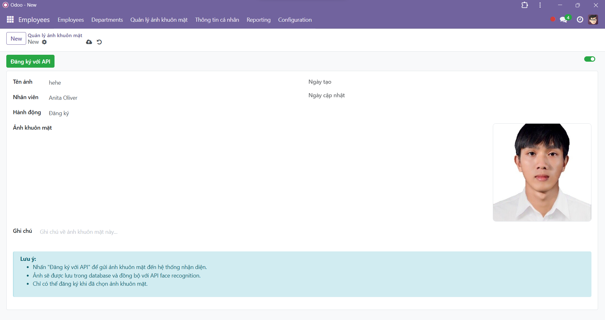
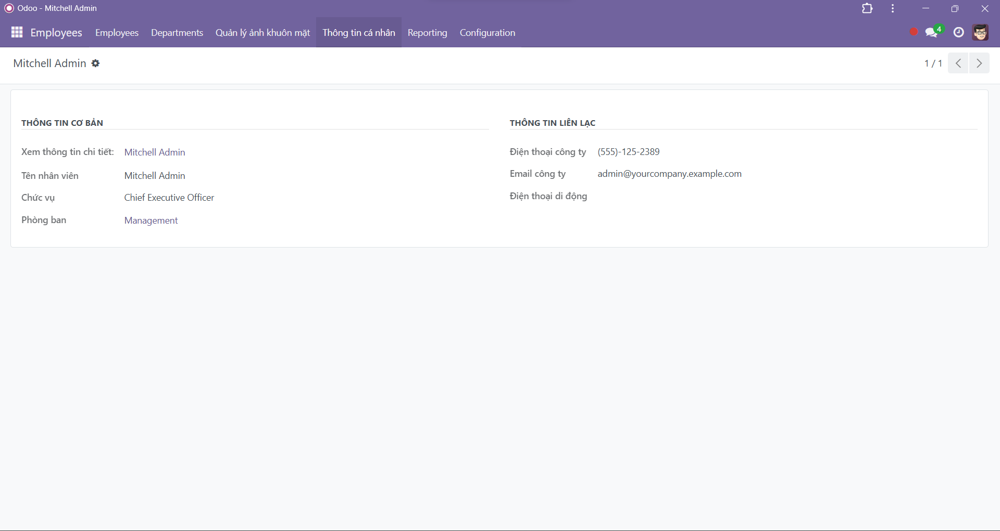
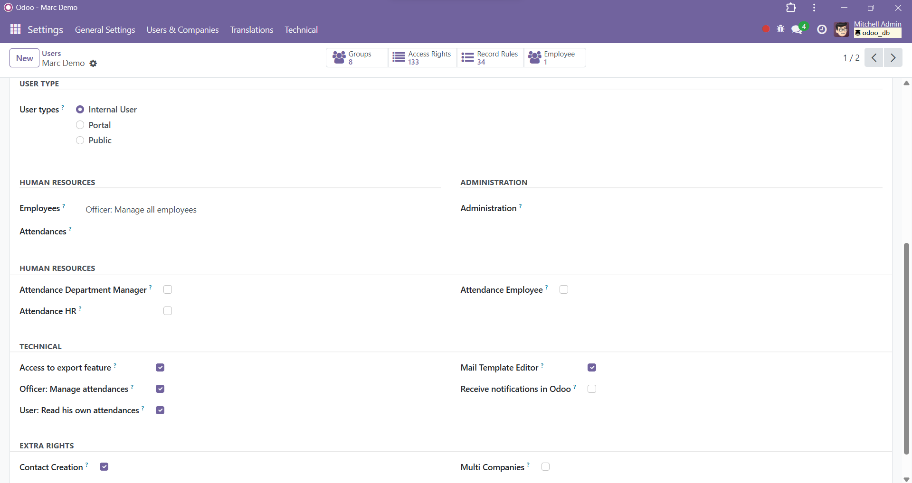

# Face Attendance System

  
  

  
  

  
  

  
  

  
  

---

Hệ thống điểm danh bằng khuôn mặt tích hợp với Odoo, sử dụng AI và Computer Vision để xác thực khuôn mặt với độ chính xác cao.

## Links

- 🌐 **Demo Website**: [https://attendance-system.ddns.net](https://attendance-system.ddns.net)

## Định hướng Refactor
Do python lúc trước chạy quá nặng không có khả năng xử lý nhiều embedding trên máy yếu nên quyết định sẽ refactor toàn bộ custom_api_service thành C++ từ nhánh này

## License

MIT License
