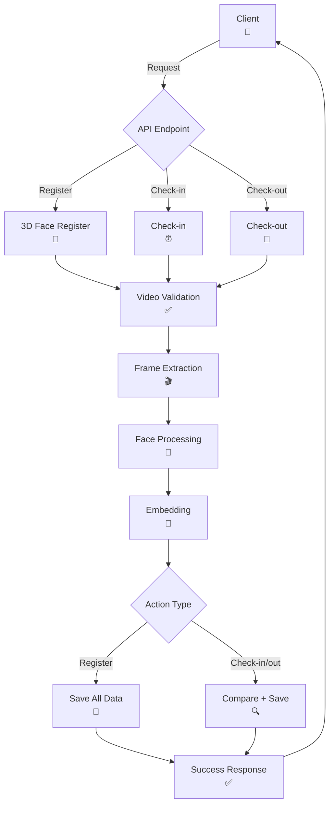
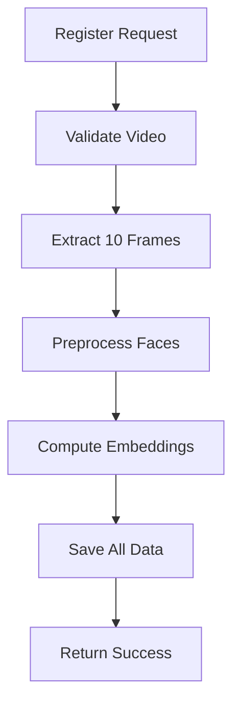
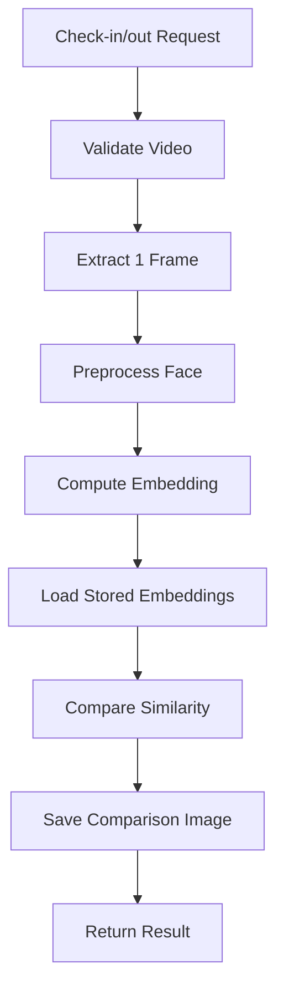
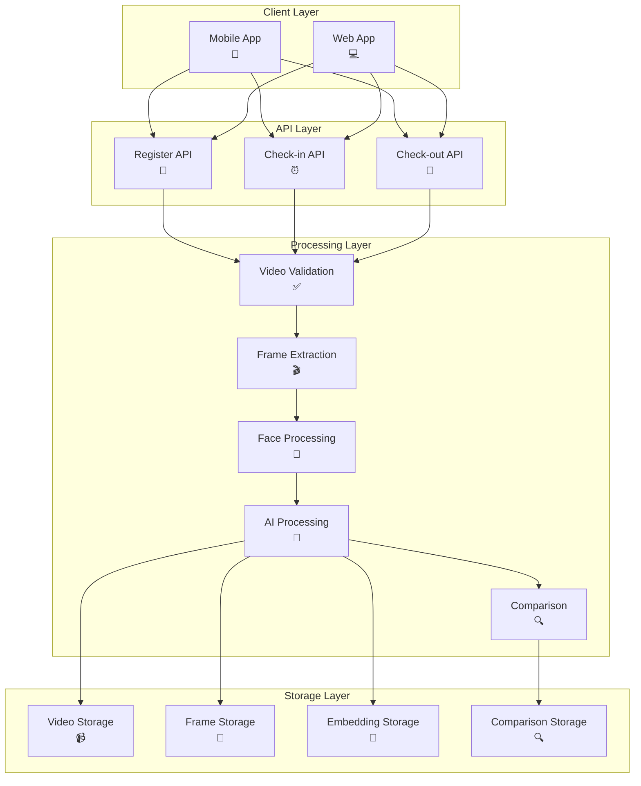
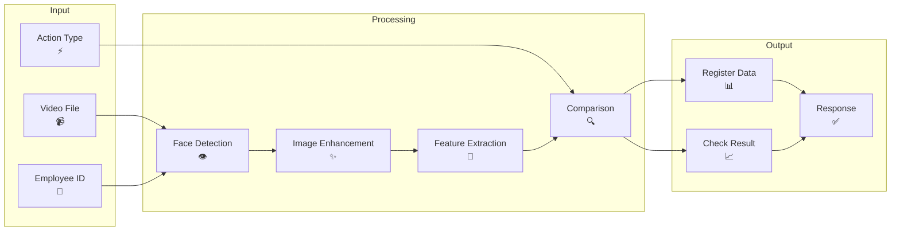
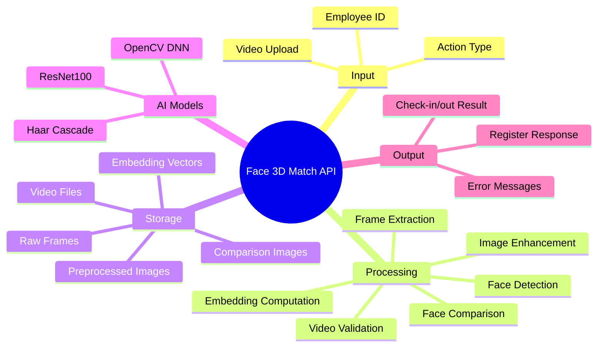
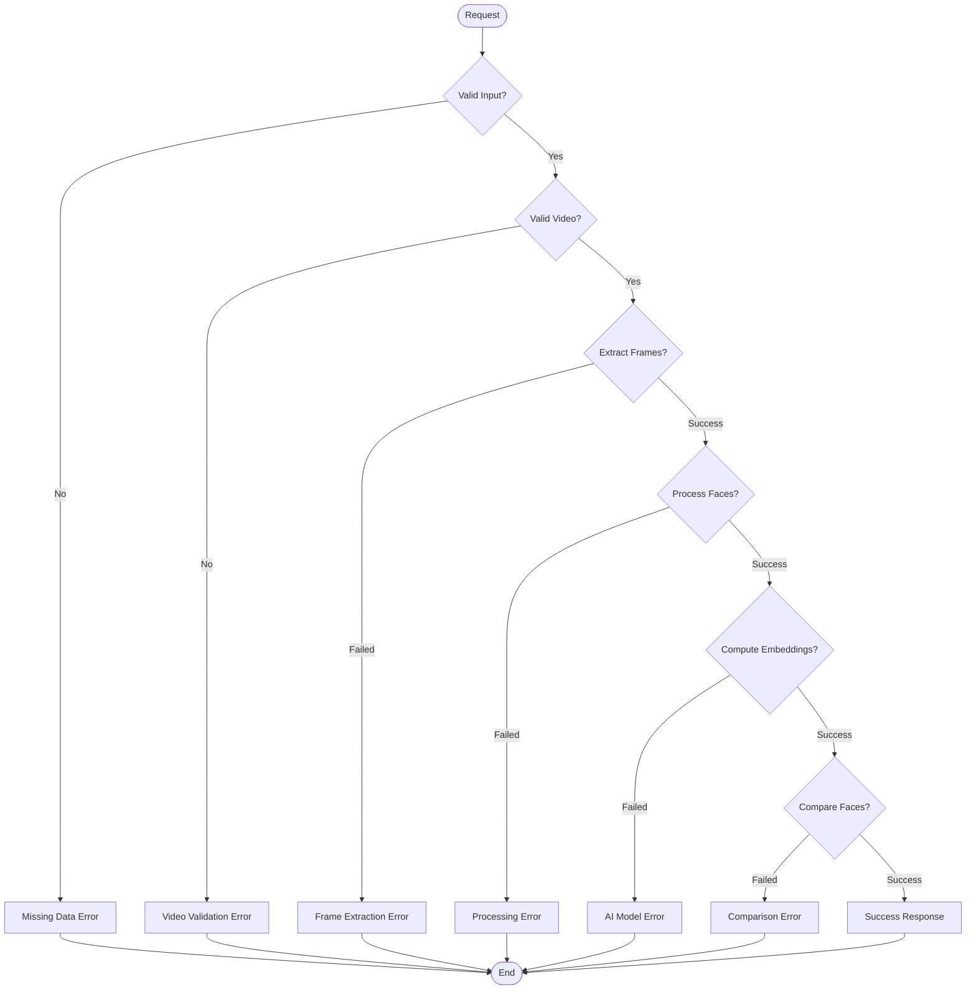
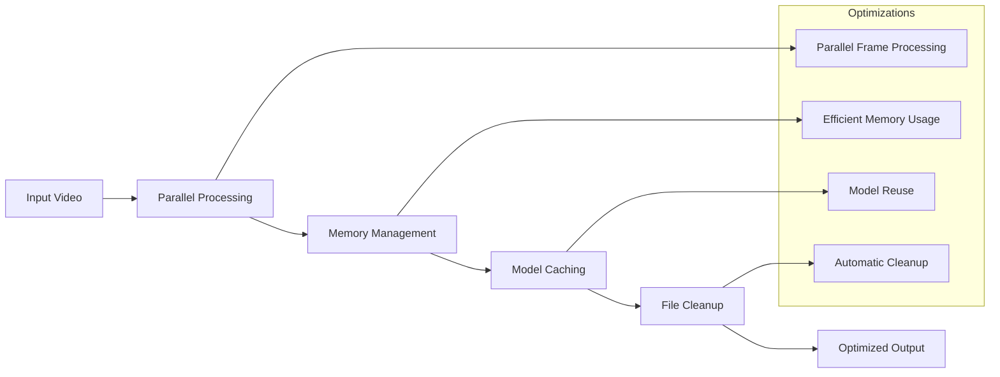
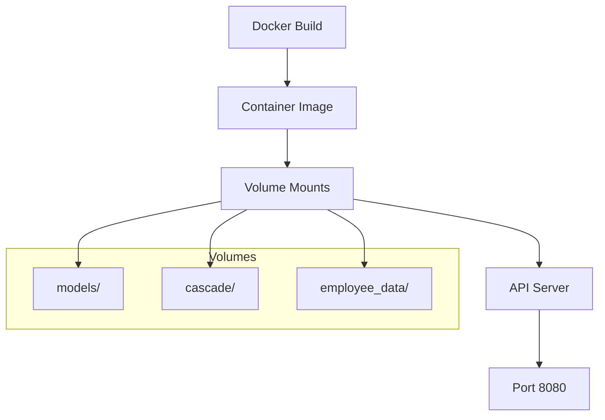

# DFD (Data Flow Diagram) - Face 3D Match API

## 📋 Tổng quan hệ thống

Hệ thống **Face 3D Match API** xử lý 3 chức năng chính: **Register**, **Check-in**, **Check-out**

### 🏗️ **Cấu trúc hệ thống:**
- **Language**: C++17 + OpenCV 4.5+ + Crow framework
- **AI Models**: ResNet100 (ONNX) + Haar Cascade
- **Storage**: File system theo Employee ID
- **Deployment**: Docker Ubuntu 24.04

### 🎯 **3 API Endpoints:**
1. **POST /api/3d-face-register** - Đăng ký khuôn mặt (10 frames)
2. **POST /api/checkin** - Check-in (1 frame + so sánh)
3. **POST /api/checkout** - Check-out (1 frame + so sánh)

### 📁 **Storage Structure:**
```
/app/employee_data/
├── video/employee_{id}/input.mp4
├── image/employee_{id}/frame_0-9.jpg
├── image_preprocess/employee_{id}/pre_0-9.jpg
├── embedding/employee_{id}/emb_0-9.txt + mean.txt
└── comparison/employee_{id}/checkin_*.jpg + checkout_*.jpg
```

## 🔄 Luồng xử lý chính (Main System Flow)



## 🔍 Luồng xử lý chi tiết (Detailed Process Flow)

### 📝 **Register Flow:**


### ⏰ **Check-in/out Flow:**


## 🏗️ Kiến trúc hệ thống (System Architecture)



## 📊 Data Flow Summary



## 🧩 Key Components



## ⚠️ Error Handling Flow



## 📈 Performance & Optimization



### ⚡ **Technical Specs:**
- **Video Format**: MP4, AVI, WebM
- **Frame Size**: 112x112 pixels
- **Embedding Dimension**: Dynamic
- **Processing Time**: 2-5 seconds
- **Storage**: ~50MB per employee
- **Similarity Threshold**: 75%

## 🔧 Deployment



### 🐳 **Docker Commands:**
```bash
# Build
docker build -t face-3d-api .

# Run
docker run -p 8080:8080 \
  -v ./models:/app/models \
  -v ./cascade:/app/cascade \
  -v ./employee_data:/app/employee_data \
  face-3d-api
```

### 🌐 **API Endpoints:**
- `GET /api/health` - Health check
- `POST /api/3d-face-register` - Register face
- `POST /api/checkin` - Check-in
- `POST /api/checkout` - Check-out
